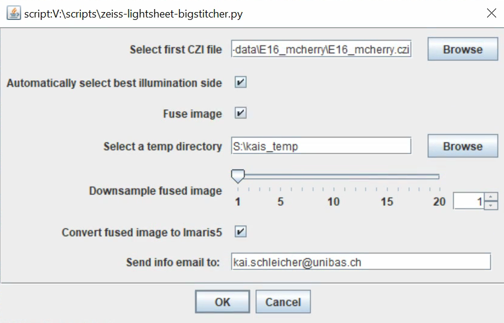
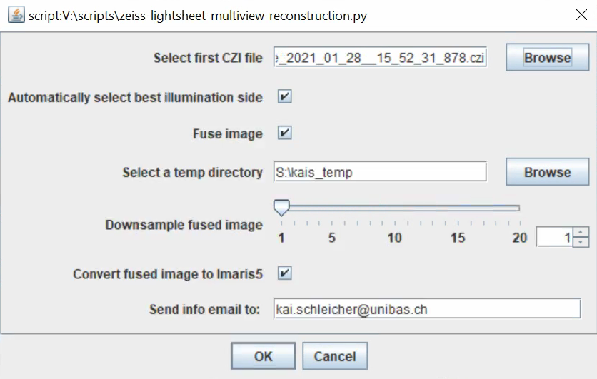

# Fiji scripts for processing Zeiss lightsheet Z.1/7 datasets using BigStitcher/ Multiview Reconstruction

These scripts are meant for automatic and easy "happy go lucky" processing of Zeiss Lightsheet datasets using the amazing [BigStitcher](https://imagej.net/BigStitcher) and [MultiView Reconstruction](https://imagej.net/Multiview-Reconstruction) in Fiji.

The goal is to provide a simple user interface to reduce the barrier of using the Lightsheet system for everyday users, for example in a facility environment. 
The scripts set default parameters that worked for several different usecases.

## Requirements
- BigStitcher >= 0.8.1
- Multiview Reconstruction >= 10.2

If you would like to use the "convert to Imaris" function, 
- Imaris FileConverter (Windows)
- kindly ask @ImageJan for his permission to use his convert-to-ims Fiji plugin

If you would like to use the mailing function,
- please change the smtp server settings according to your institute

## zeiss-lightsheet-bigstitcher
For stitching tiled datasets
Please note: 
- tiles acquired on the Zeiss LS 7 using the build-in tiling function in Zen [can currently NOT be read properly by BigStitcher](https://forum.image.sc/t/change-in-czi-tile-info-metadata-after-upgrade-to-zeiss-lightsheet-7/49414)
- alternatively, use the Zen black tiling-macro that was formerly used in the LS Z.1

## zeiss-lightsheet-multiview-reconstruction.py
For reconstructing MultiView (=multi-angle) datasets

